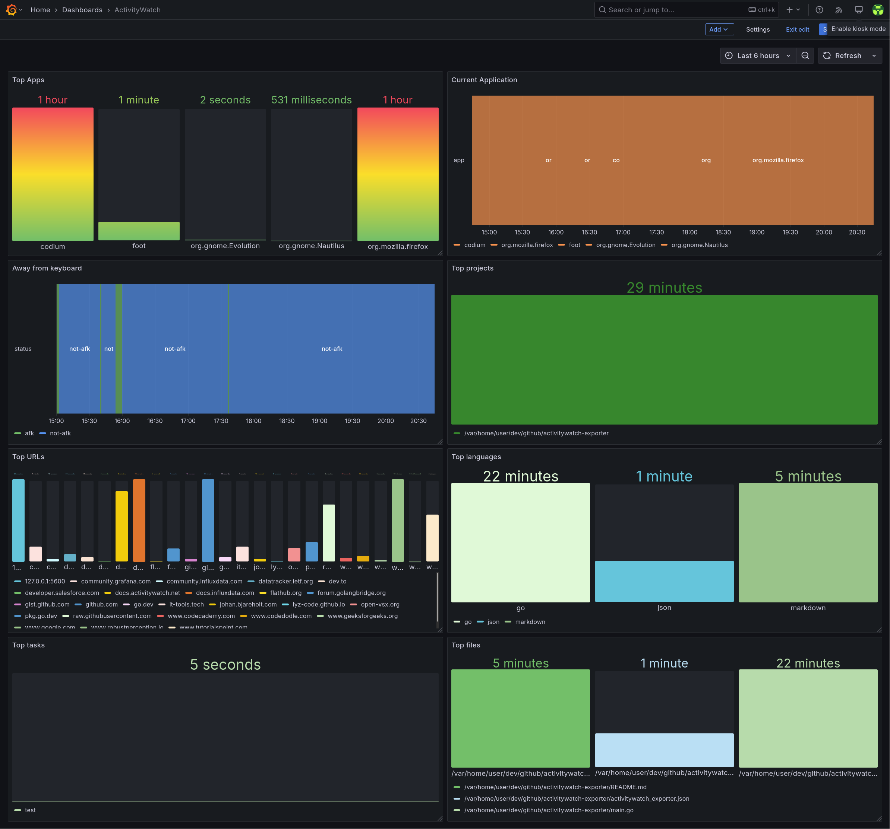

# activitywatch-exporter

CLI tool that uploads the ActivityWatch data from the aw-server API to influxdb on a daily basis

## Dependencies

- [go](https://go.dev/)
- [influxdb v2+](https://docs.influxdata.com/influxdb/v2.6/)
- Optional:
  - [make](https://www.gnu.org/software/make/) - for automatic installation support
  - [docker](https://docs.docker.com/)
  - [podman](https://docs.podman.io)
  - [systemd](https://systemd.io/)

## Relevant documentation

- [ActivityWatch API](https://docs.activitywatch.net/en/latest/api/rest.html)
- [ActivityWatch Data Model](https://docs.activitywatch.net/en/latest/buckets-and-events.html#id1)
- [InfluxDB API](https://docs.influxdata.com/influxdb/v2.6/write-data/developer-tools/api/)
- [Systemd Timers](https://www.freedesktop.org/software/systemd/man/systemd.timer.html)
- [compose-scheduler](https://github.com/reddec/compose-scheduler)

## Installation

### With Podman Quadlets and systemd timer

1. Configure `activitywatch_exporter.json` (see the configuration section below).
1. Copy `activitywatch-exporter.container` to `$HOME/.config/containers/systemd/activitywatch-exporter.container`
1. Copy `activitywatch-exporter.timer` to `$HOME/.config/systemd/user/activitywatch-exporter.timer`
1. Reload the user's systemd daemon

   ```bash
    systemctl --user daemon-reload
   ```

1. Run it.

   ```bash
    systemctl --user start activitywatch-exporter.timer
   ```

### With Docker

#### docker-compose

1. Configure `activitywatch_exporter.json` (see the configuration section below).
1. Run it.

   ```bash
   docker compose up --detach
   ```

#### docker build & run

1. Build the docker image.

   ```bash
   docker build . --tag activitywatch-exporter
   ```

1. Configure `activitywatch_exporter.json` (see the configuration section below).
1. Run it.

    ```bash
    docker run --rm --init --tty --interactive --read-only --cap-drop ALL --security-opt no-new-privileges:true --cpus 2 -m 64m --pids-limit 16 --volume ./activitywatch_exporter.json:/app/activitywatch_exporter.json:ro ghcr.io/rare-magma/activitywatch-exporter:latest
    ```

### With the Makefile

For convenience, you can install this exporter with the following command or follow the manual process described in the next paragraph.

```bash
make build
make install
$EDITOR $HOME/.config/activitywatch_exporter.json
```

### Manually

1. Build `activitywatch_exporter` with:

    ```bash
    go build -ldflags="-s -w" -o activitywatch_exporter main.go
    ```

2. Copy `activitywatch_exporter` to `$HOME/.local/bin/` and make it executable.

3. Copy `activitywatch_exporter.json` to `$HOME/.config/`, configure it (see the configuration section below) and make it read only.

4. Copy the systemd unit and timer to `$HOME/.config/systemd/user/`:

    ```bash
    cp activitywatch-exporter.* $HOME/.config/systemd/user/
    ```

5. and run the following command to activate the timer:

    ```bash
    systemctl --user enable --now activitywatch-exporter.timer
    ```

It's possible to trigger the execution by running manually:

```bash
systemctl --user start activitywatch-exporter.service
```

### Config file

The config file has a few options:

```json
{
 "InfluxDBHost": "influxdb.example.com",
 "InfluxDBApiToken": "ZXhhbXBsZXRva2VuZXhhcXdzZGFzZGptcW9kcXdvZGptcXdvZHF3b2RqbXF3ZHFhc2RhCg==",
 "Org": "home",
 "Bucket": "activitywatch",
 "ActivityWatchUrl": "http://127.0.0.1:5600"
}
```

- `InfluxDBHost` should be the FQDN of the influxdb server.
- `Org` should be the name of the influxdb organization that contains the ActivityWatch data bucket defined below.
- `Bucket` should be the name of the influxdb bucket that will hold the ActivityWatch data.
- `InfluxDBApiToken` should be the influxdb API token value.
  - This token should have write access to the `BUCKET` defined above.
- `ActivityWatchUrl` should be the URL of the aw-server instance.

## Exporting activitywatch data for dates in the past

If the cli is passed a number with the `--days` cli flag, it will query the aw-server API for an interval in the past longer than the default time range of just the last 24 hours (1 day).

Example:

```bash

~/.local/bin/activitywatch_exporter --days 30

```

## Troubleshooting

Check the systemd service logs and timer info with:

```bash
journalctl --user --unit activitywatch-exporter.service
systemctl --user list-timers
```

## Exported metrics

- duration: Total time in seconds

## Exported metrics example

```plain
afkstatus,client=aw-watcher-afk,hostname=desktop duration=38.801,status="afk" 1742056580
general.stopwatch,client=aw-webui,hostname=unknown,label=test duration=5.128,running=false 1742050028
app.editor.activity,client=aw-watcher-vscode,hostname=desktop,project=/var/home/user/dev/github/activitywatch-exporter,language=go,file=/var/home/user/dev/github/activitywatch-exporter/main.go duration=28.875 1742060278
web.tab.current,client=aw-client-web,hostname=desktop,url=github.com duration=120.056,audible=false,incognito=false 1742060146
currentwindow,client=aw-watcher-window,hostname=desktop,app=firefox duration=25.523 1741974028
```

## Example grafana dashboard

In `activitywatch-dashboard.json` there is an example of the kind of dashboard that can be built with `activitywatch-exporter` data:



Import it by doing the following:

1. Create a dashboard
2. Click the dashboard's settings button on the top right.
3. Go to JSON Model and then paste there the content of the `activitywatch-dashboard.json` file.

## Uninstallation

### With the Makefile

For convenience, you can uninstall this exporter with the following command or follow the process described in the next paragraph.

```bash
make uninstall
```

### Manually

Run the following command to deactivate the timer:

```bash
systemctl --user disable --now activitywatch-exporter.timer
```

Delete the following files:

```bash
~/.local/bin/activitywatch_exporter
~/.config/activitywatch_exporter.json
~/.config/systemd/user/activitywatch-exporter.timer
~/.config/systemd/user/activitywatch-exporter.service
```

## Credits

- [podman quadlets](https://docs.podman.io/en/latest/markdown/podman-systemd.unit.5.html)
- [reddec/compose-scheduler](https://github.com/reddec/compose-scheduler)

This project takes inspiration from the following:

- [phrp720/aw-sync-suite](https://github.com/phrp720/aw-sync-suite)
